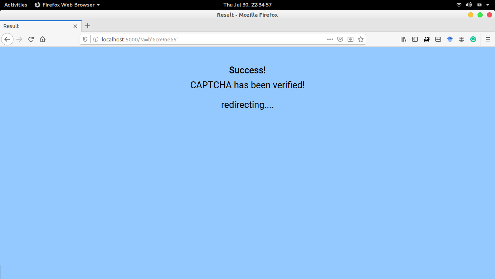

# Digital Cane

We all use internet on a daily basis and we've all encountered one common, annoying thing: CAPTCHA. 
That's the thing which verifies whether the person requesting some web content, is a human or not. 
While it's not that difficult for us normal users, it is quite a challenge for the visually impaired. 
The visually challenged people use computers and browse internet, with the use of text-to-speech softwares.
You might think audio CAPTCHAs solve the problem, but they don't. They just make things worse.

So, what do they do? How can a blind person using the internet prove he's not a robot? This project is an attempt at solving the respective problem. This was a team project, presented at **Smart India Hackathon (SIH)** 2020.

## Our approach

Assuming that the concerned person is using a text-to-speech software:

* Instead of the typical CAPTCHA page, he/she will be redirected to our page (think of it like a service), which, as you can see above, simply consists of some text and one form entry.
* The text part is a simple question, that any person will generally know and it's framed such that the answer is always a number. In the above case, the answer is **5**.
* Now the user has to remember the answer and consider it as some position. In the above eg. case, he/she will have to remember **'5'** as **'some position'**.
* Then a list of, random and easy-to-spell, english words will be generated(usually 7 words). Now the user has to figure out that word, that exists at the **'position'** they previously had to remember.
* In the above case, the words: "meme, wind, hope, hard, jack, mole, hand" are generated. The **'answer'** we had to remember was the number **'5'**. 
* Then we figure out, among the generated words, what word existed at the postion we remember as an answer. In the above case, it's the word **'jack'**, as it's at the **5th** position.
* Then this word is entered in the form and the user will click 'submit'. If it all checks out, then they've **passed** the CAPTCHA test.

Then they're redirected to the site they wanted to visit in the first place.

Ok so that was a lot to follow. And I know it's not a great idea. I'm pretty sure you have lots of questions at this point.

And obviously, there's a lots of gaps in this idea and many assumptions are made as well. After presenting this in **SIH**, we were criticized of many loop holes , such as "How can you be sure that 'bots' cannot crack it?", 
"How does this solve the problem of CAPTCHA?" and the best: "Do you really think this is a problem? Only a tiny percentage of people are blind and that too, those who use internet. *Are you sure this problem is even worth solving?*". 
I mean, we took this problem statement from the SIH page, so this does definitely exist, just that we don't know on what scale. 

Anyways SIH was fun and, me and my team could learn a bit at least, if not win the competition. And I thougth it'd be better if I put it on GitHub, and in that way its not a complete waste :P 

For some reason, if you want to contribute:
* Clone/Download this repo.
* Only dependency is [flask](https://flask.palletsprojects.com/en/1.1.x/), so make sure you have that installed.
* Start developing! 

Thanks for reading this :') 

P.S : This was made at the time, when I just started web dev with python :P . I even remember not knowing what HTTP was, what request-response was, at that time. And hence the cringe worthy code.   

